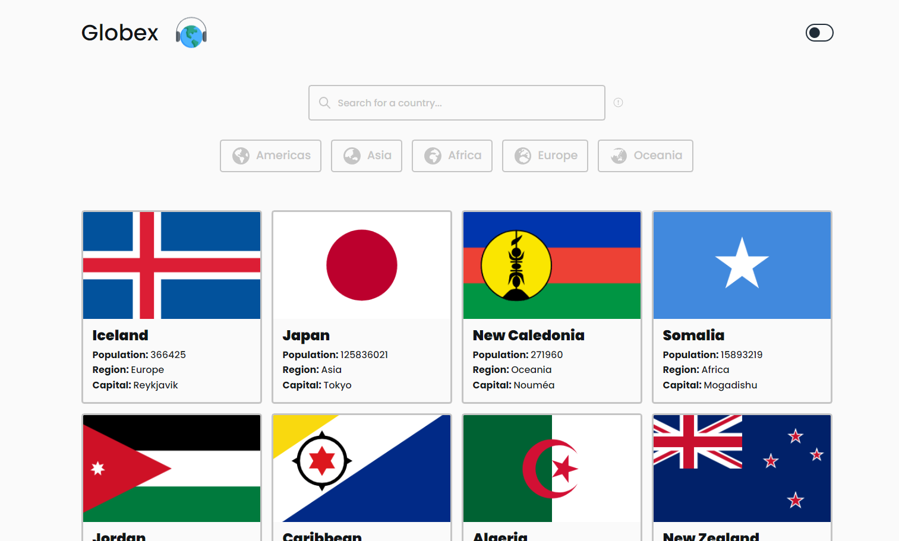

## Table of contents

- [Overview](#overview)
  - [The challenge](#the-challenge)
  - [Screenshot](#screenshot)
  - [Links](#links)
- [My process](#my-process)
  - [Built with](#built-with)
- [Author](#author)

## Overview

### The challenge

Users should be able to:

- See all countries from the API on the homepage
- Search for a country using an `input` field
- Filter countries by region
- Click on a country to see more detailed information on a separate page
- Click through to the border countries on the detail page
- Toggle the color scheme between light and dark mode

### Screenshot

### Links

- Live Site URL: [Globex App](https://globex-app.vercel.app/)

## My process

### Built with

- Semantic HTML5 markup
- CSS custom properties
- Vue3 - UI framework
- Pinia - Local state management
- Vue-Query - Remote state management (fetching data)
- Responsive
- Light / Dark mode

## Author

- Website - [Giancarlo Guerra Portfolio](https://personal-portfolio-swart-phi.vercel.app/)
- LinkedIn- [@giancarloguerraf](https://www.linkedin.com/in/giancarloguerraf/)
